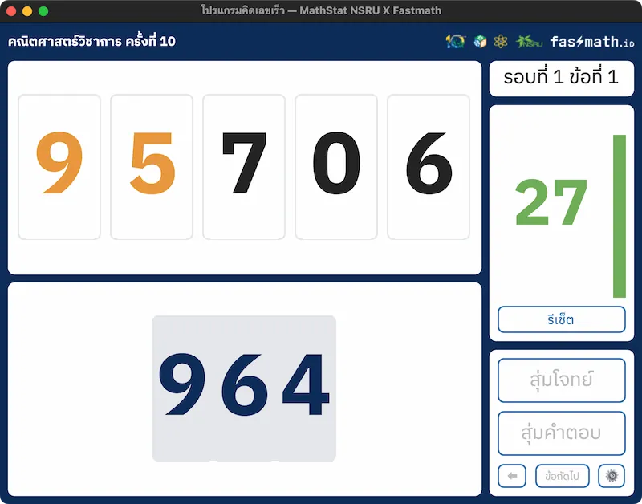

# โปรแกรมคิดเลขเร็ว — MathStat NSRU X Fastmath

"โปรแกรมคิดเลขเร็ว — MathStat NSRU X Fastmath" พัฒนาร่วมกับสาขาวิชาคณิตศาสตร์และสถิติ คณะวิทยาศาสตร์และเทคโนโลยี มหาวิทยาลัยราชภัฏนครสวรรค์

<div align="center">
  
</div>

## ดาวน์โหลดและติดตั้งโปรแกรม

ท่านสามารถ[ดาวน์โหลดโปรแกรมได้ที่นี่](https://github.com/Fastmath-Team/180iq-program/releases/download/v1.3.0/MathStat.NSRU.X.Fastmath.zip)

[](https://github.com/Fastmath-Team/180iq-program/releases/download/v1.3.0/MathStat.NSRU.X.Fastmath.zip)

เมื่อดาวน์โหลดเสร็จสิ้น ให้ท่านทำการแตกไฟล์ zip จะมีไฟล์ `โปรแกรมคิดเลขเร็ว — MathStat NSRU X Fastmath.exe` ซึ่งสามารถเปิดใช้งานได้เลย โดยไม่ต้องทำการติดตั้งใดๆ

> [!IMPORTANT]
> เพื่อการแสดงผลที่ดี กรุณาติดตั้งฟอนต์ที่อยู่ในโฟลเดอร์ `fonts` โดยทำการลากไฟล์ `IBMPlexSansThai-Regular.ttf` และ `IBMPlexSansThai-Bold.ttf` ไปยังโฟลเดอร์ `C:/Windows/Fonts`

## Development

1. ลง library ที่ต้องใช้ โดยการใช้คำสั่ง

```bash
pip install -r requirements.txt
```

> แนะนำให้ทำ env ก่อน เพื่อไม่ให้ library ไปรวมกับ library ส่วนรวม
>
> ```bash
> python3 -m venv env
> ```
>
> แล้ว activate environment
>
> ```cmd
> .\env\Scripts\Activate
> ```
>
> หรือ
>
> ```bash
> source ./env/bin/activate
> ```

2. รันไฟล์ `main.py`

```bash
python3 main.py
```

## Attribution

- `ding.wav` by tim.kahn -- https://freesound.org/s/91926/ -- License: Attribution 4.0
